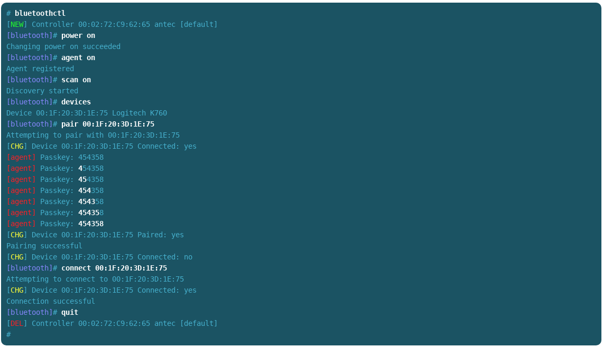

 # ConsoleOutput

A [MediaWiki](https://www.mediawiki.org) extension that provides a new tag, `<console>`, which can be used to format 
and colorize terminal output.

Its purpose is to accurately display colors that appear on terminals, and provide a means to highlight commands
that a user types so that they are easy to see in relation to program output. This extension is used by 
[Funtoo Linux](https://www.funtoo.org) for its installation and other documentation.

* [GitHub page](http://github.com/BreezyOps/MediaWiki-ConsoleOutput) 
* [MediaWiki page](https://www.mediawiki.org/wiki/Extension:ConsoleOutput)
* [Funtoo Linux](https://www.funtoo.org)

## Download/Install

Using git:

    $ cd extensions
    $ git clone https://github.com/BreezyOps/MediaWiki-ConsoleOutput.git ConsoleOutput

Then, add the following line to your `LocalSettings.php` file:

    wfLoadExtension( 'ConsoleOutput' );

## Example

Here's an example of what the ConsoleOutput extension can be used for. In this case, we are using it to show the user
how to interact with the Linux `bluetoothctl` command:

## How to Use on Your Wiki

To use it, copy and paste a portion of your terminal into the MediaWiki editor, and surround it with `<console>` 
opening and closing tags.

This tag works similarly to a `<pre>` tag, and preserves output formatting in the quoted text.

### Highlighting User Input

To highlight text typed by a user, in order to differentiate it from program output, put a `##i##` input code immediately
before user input on each line. This will cause all text from the `##i##` to the end of the line to be highlighted in
orange to offset it from the prompt and other program output. If you would like to turn off highlighting of user input
prior to the end-of-line, insert the `##!i##` input code into your terminal paste.

### Colorization of Output

Colorization of terminal output works similarly to the highlighting of user input, with the following special input
codes available for tagging your terminal paste. Again, note that by default, these tags will be in effect until the
end-of-line, unless manually disabled using the appropriate "disable" code.

### Customizing CSS

You may find it beneficial to customize the CSS included in this extension to suit your personal preference and match
the design of your wiki.

The extension has two files, `css/screen.css` and `css/print.css`, which are used to specify the colors used for
display on-screen and when the page is printed. You can customize these CSS settings to your liking. Additional CSS
is also included to harmonize the rendering of the `<console>` output with `<tt>`, `<pre>` and syntax highlighting
output.

### Code Table

Here is a complete list of codes recognized by the ConsoleOutput extension:

Color/Function | Code     | Disable Code 
-------------- | ------   | ---------
User Input     | `##i##`  | `##!i##`
Color:Green    | `##g##`  | `##!g##`
Color:Yellow   | `##y##`  | `##!y##`
Color:Blue     | `##bl##` | `##!bl##`
Color:Red      | `##r##`  | `##!r##`
Color:Cyan     | `##c##`  | `##!c##`
Output:Bold    | `##b##`  | `##!b##`

Please note that it is fairly easy to add more codes and colors as needed by extending the `console` method in 
`ConsoleOutput.php` and then adding any necessary CSS classes to the CSS files.

License
-------

This code is copyright 2013-2018 Funtoo Solutions, Inc. and is distributed under the GNU General Public 
License version 2, or later.
